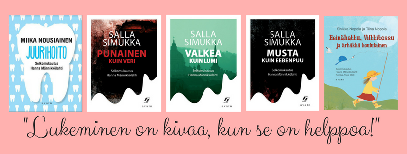

```{r, include=FALSE}
knitr::opts_chunk$set(results = 'asis',
                      echo = FALSE,
                      warning = FALSE,
                      tidy = FALSE,
                      message = FALSE,
                      fig.align = 'center',
                      out.width = "90%",
                      fig.lp = '')
options(knitr.table.format = "html") 
```

```{r pkgs}
source(here::here("R", "02_libraries.R"))
```

```{r, include=FALSE}
knitr::write_bib(c('posterdown', 'rmarkdown','pagedown', 'ggmap', 'ggthemes', 'ggforce', 'knitr', 'here', 'tibble', 'readr', 'ggplot2', 'base'), 'packages.bib')
```


# Mitä?

Selkosuomeksi kirjat on kirjoitettu helpolla kielellä. Nämä kirjat eivät ole kuin lastenkirjat. Selkosuomeksi kirjat ovat tavallisia, joskus aikuisille, kirjat on mukautettu yleiskieleltä selkokielelle. 
<!-- Ajatelletteko ne ovat mielenkiintoista?  -->

Löydätte lisää informaatio Hanna Männikkölahden sivusta: https://privatefinnishlessons.com/books/

# Miksi?

Lukea on hyvä väline koska voitte harjoittaa lukemista, puhumista ja ymmärtämistä.  Esimerkiksi, voitte lukea teksti ystävälle tai yksin.

# Missä?

Jyväskylän kaupunginkirjastolla on monta selkosuomeksi kirjat!

Jos haluatte lainata kirja kirjastosta, tarvitsette kirjastokortti. Tarvitsette ottaa kuvallinen henkilökortti kirjastoon jotta he tekevät kirjastokortti sinulle. Ensimmäinen kortti on ilmainen. 
Ettekö tiedä missä kirjasto on? Näette karttassa.


```{r jyv-map-r, include=FALSE}
load(file = here::here("data", "01_kartta.RData"))
```


```{r actual-map}
kartta

# fig.cap="Löydätte kirjasto tästä"
```

# Miten?

Nyt luen “Toppatakin alla on sydän”. Kirjalla on monta pieni tekstit ja yritän lukea yksi teksti joka päivä. En ymmärrä kaikki sanat, ajattelen että ymmärtää tekstin idea riittää. Kun en ymmärrä sanat, kirjoitan niitä ja haen mitä ne tarkoittavat sanakirjasta.

# Media

<!-- <center> -->
<!--  -->
<!-- </center> -->


<!-- <iframe style="border: 0px" frameborder="0" type="text/html" allowfullscreen="true" webkitallowfullscreen="true" mozallowfullscreen="true" oallowfullscreen="true" msallowfullscreen="true" width="100%" src="https://m3.jyu.fi/jyumv/embed?uid=2c3d85eaab0a42599d948982bc1b0480" height="770"> -->
<!-- </iframe> -->
Muut selkokirjat Hanna Männikkölahden sivusta:
<center>

</center>


<!-- <iframe style="border: 0px" frameborder="0" type="text/html" allowfullscreen="true" webkitallowfullscreen="true" mozallowfullscreen="true" oallowfullscreen="true" msallowfullscreen="true" width="100%" src="https://m3.jyu.fi/jyumv/embed?uid=34d38443ec50432981e2f207da5734a1" height="770"> -->
<!-- </iframe> -->
Nyt luen:
<center>

</center>

# Kirjallisuus ja kiitokset

Kiitos M. Oksala, J. Lainio, E. Lee, I. Mian ja J. Panjwani auttosta tämä posteri.

Tein tämä posterin R:n kanssa. Käytin nämä paketit:


<!-- # Introduction -->

<!-- This is the `posterdown_betterland` template for the {posterdown} package! I was inspired by the twitter thread of [Mike Morrison](https://mobile.twitter.com/mikemorrison/status/1110191245035479041) and wanted to apply the `#betterposter` concept to the reproducible (yet simple to use) functionality of the {posterdown} package [@R-posterdown]. If you're not an R user don't sweat as you do **NOT** need to use it at all! Feel free to use only the Markdown functionality of this package :) -->

<!-- ## Objectives -->

<!-- 1. Pick a template layout. -->
<!-- 2. Write/ create your poster content distraction free. -->
<!-- 3. Let posterdown do its thing! -->

<!-- # Methods -->

<!-- I will show here how to include poster elements that may be useful, such as an equation using mathjax: -->

<!-- $$ -->
<!-- E = mc^2 -->
<!-- $$ -->

<!-- To reference a citation you can add your `.bib` file to the working directory and name it in the YAML metadata or generate an automated one as done here, then you only need to reference the label value in the `.bib` file. For example this package is built on top of the wonderful {pagedown} package and I will cite it at the end of this sentance using this in the rmd `[@R-pagedown]` [@R-pagedown]. -->

<!-- To get a better understanding of how to include features like these please refer to the {posterdown} [wiki](https://github.com/posterdown/wiki). -->

<!-- **_Now on to the results!_** -->

<!-- <br> -->

<!-- # Results -->

<!-- Here you may have some figures to show off, bellow I have made a scatterplot with the infamous Iris dataset and I can even reference to the figure automatically like this, `Figure \@ref(fig:irisfigure)`, Figure \@ref(fig:irisfigure). -->

<!-- ```{r, irisfigure, fig.cap='Here is a caption for the figure. This can be added by using the "fig.cap" option in the r code chunk options, see this [link](https://yihui.name/knitr/options/#plots) from the legend himself, [Yihui Xie](https://twitter.com/xieyihui).', out.width="80%"} -->
<!-- par(mar=c(2,2,0,1)) -->
<!-- plot(x = iris$Sepal.Length, y = iris$Sepal.Width, -->
<!--      col = iris$Species, pch = 19, xlab = "Sepal Length", -->
<!--      ylab = "Sepal Width") -->
<!-- ``` -->

<!-- Maybe you want to show off some of that fancy code you spent so much time on to make that figure, well you can do that too! Just use the `echo=TRUE` option in the r code chunk options, Figure \@ref(fig:myprettycode)! -->

<!-- ```{r myprettycode, echo=FALSE,collapse=TRUE, fig.cap='Boxplots, so hot right now!', fig.height=3.5, out.width="80%"} -->
<!-- #trim whitespace -->
<!-- par(mar=c(2,2,0,0)) -->
<!-- #plot boxplots -->
<!-- boxplot(iris$Sepal.Width~iris$Species, -->
<!--         col = "#008080",  -->
<!--         border = "#0b4545", -->
<!--         ylab = "Sepal Width (cm)", -->
<!--         xlab = "Species") -->
<!-- ``` -->

<!-- How about a neat table of data? See, Table \@ref(tab:iristable): -->

<!-- ```{r, iristable} -->
<!-- knitr::kable( -->
<!--   iris[1:8,1:5], format = "html", -->
<!--   caption = "A table made with the **knitr::kable** function.", -->
<!--   align = "c", col.names = c("Sepal <br> Length", -->
<!--                              "Sepal <br> Width", -->
<!--                              "Petal <br> Length", -->
<!--                              "Petal <br> Width", -->
<!--                              "Species"), -->
<!--   escape = FALSE) -->
<!-- ``` -->